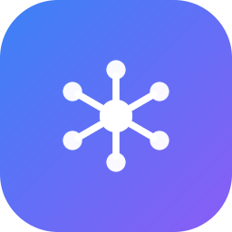
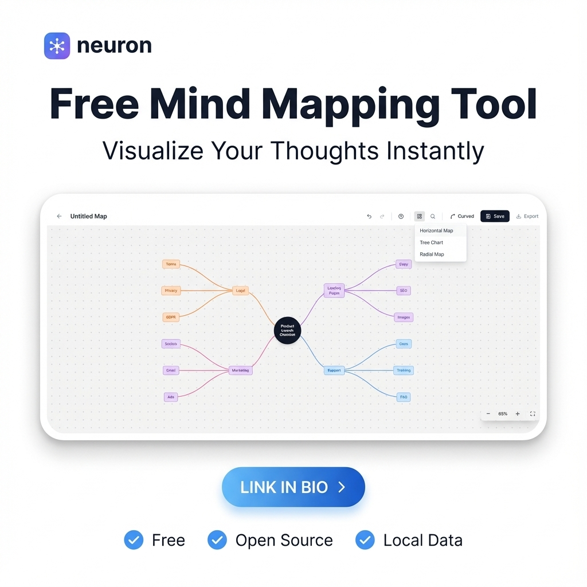
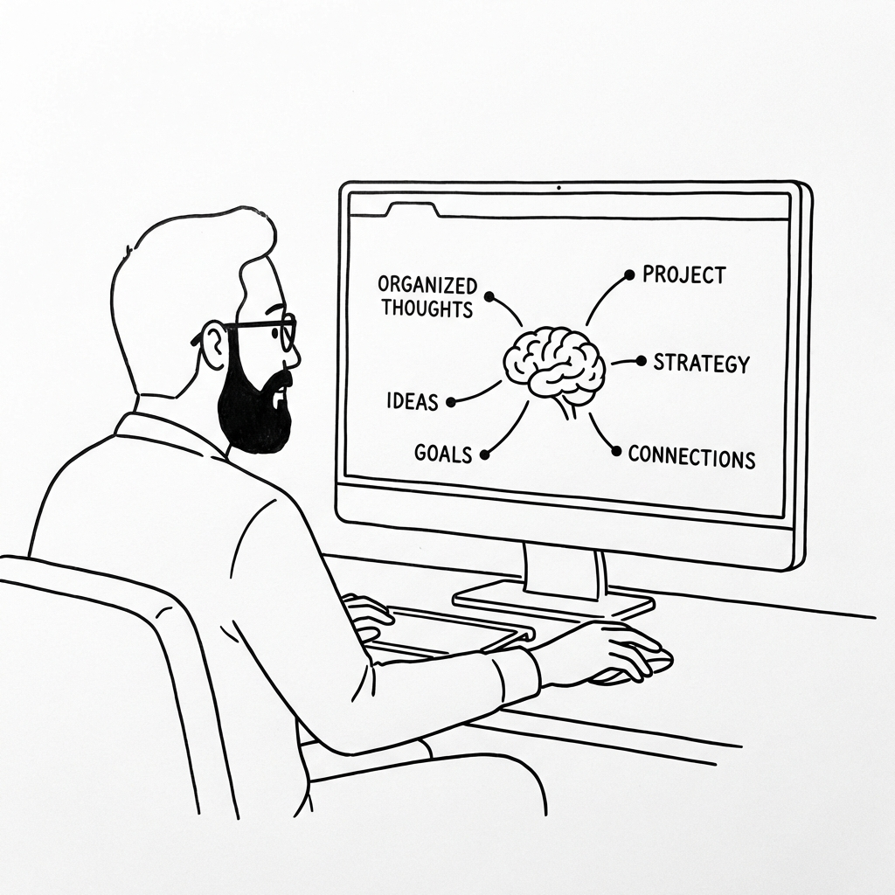
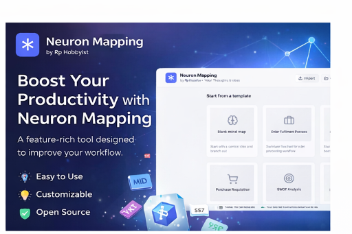
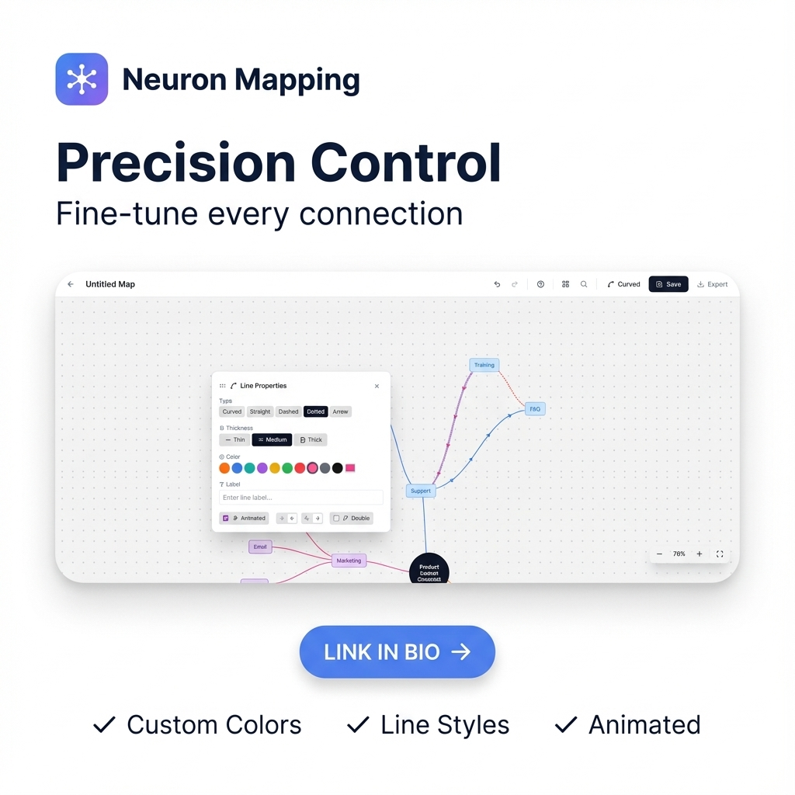

# Neuron Mapping v1.5.0

<div align="center">
  
  <br>
  

  [](https://www.gnu.org/licenses/agpl-3.0)
  [](https://github.com/RPHobbyist/NeuronMapping/releases)
  [](https://www.rphobbyist.com)
  [](https://neuron-mapping.rphobbyist.com/)

  ### **Your Thoughts, Visually Organized**
  *The ultimate visual mind mapping tool for brainstorming, planning, and structured thinking.*

  [🌐 Use Online](https://neuron-mapping.rphobbyist.com/) | [💻 Download Desktop App](https://github.com/RPHobbyist/NeuronMapping/releases)
</div>

---

## 🧠 About Neuron Mapping

<p align="justify">
  <strong>Neuron Mapping</strong> is a powerful and intuitive visual <strong>mind mapping tool</strong> designed for professionals, students, and creative thinkers. It allows you to organize ideas, brainstorm complex projects, and structure thoughts with ease. Whether you're planning a new business venture or mapping out a research paper, Neuron Mapping provides the canvas you need to bring clarity to chaos.
</p>



---

## 📺 Video Tutorial

Watch the official tutorial to learn how to master Neuron Mapping:

[](https://youtu.be/tZC3a-83HXI)

---

## 🚀 What's New in Version 1.5?

The v1.5 update enhances the core mapping engine and introduces new customization options for a more fluid creative experience.

<p align="center">
  
  
</p>

### 🛠️ Key Capabilities

#### **✨ Dynamic Mind Mapping**
- **🎨 Infinite Canvas**: Create sprawling mind maps without limits, with smooth pan and zoom.
- **🔗 Flexible Connections**: Choose between curved, straight, or stepped connection lines to suit your style.
- **🖌️ Freehand Drawing**: Annotate your maps directly on the canvas with built-in drawing tools.

#### **📝 Templates & Structure**
- **📋 Ready-to-Use Templates**: Start your projects faster with built-in mind map structures.
- **📁 Organized Nodes**: Color-code and style individual nodes to create visual hierarchies.
- **🔍 Quick Search**: Find specific nodes or ideas instantly within complex maps.

#### **💾 Persistence & Portability**
- **⚡ Auto-Save**: Your progress is automatically saved to the system's application data folder.
- **📥 Import/Export**: Save your maps as `.nmm` files for backup or export them as high-quality **Images** or **PDFs**.
- **🔒 Privacy-First**: All your data is stored locally on your machine.

---

## 🛠️ Technical Specifications

- **Tech Stack**: Built with **React**, **Three.js** (for advanced visuals), and **Tailwind CSS**.
- **Platform Support**: Cross-platform desktop performance via **Electron** and mobile-responsive web.
- **File Format**: Native `.nmm` format for seamless project sharing and backups.
- **License**: Open Source under **AGPL v3**.

---

## 🚀 Get Started

### 📦 Download & Run
Neuron Mapping is provided as a pre-compiled application for a seamless experience.
1. Download the **Neuron_Mapping_v.1.5.0.zip** package.
2. Unzip the contents to your preferred location.
3. Run the `Neuron Mapping.exe` (Windows) to start mapping instantly.

### 🖥️ Development Setup
If you wish to contribute or run from source:
```bash
# Clone the repository
git clone https://github.com/RPHobbyist/NeuronMapping
cd NeuronMapping

# Install dependencies
npm install

# Start development server
npm run dev
```

---

<div align="center">
  Made by <strong><a href="https://www.rphobbyist.com">RP Hobbyist</a></strong>
  <br>
  <em>Empowering minds with professional-grade creative tools.</em>
</div>
