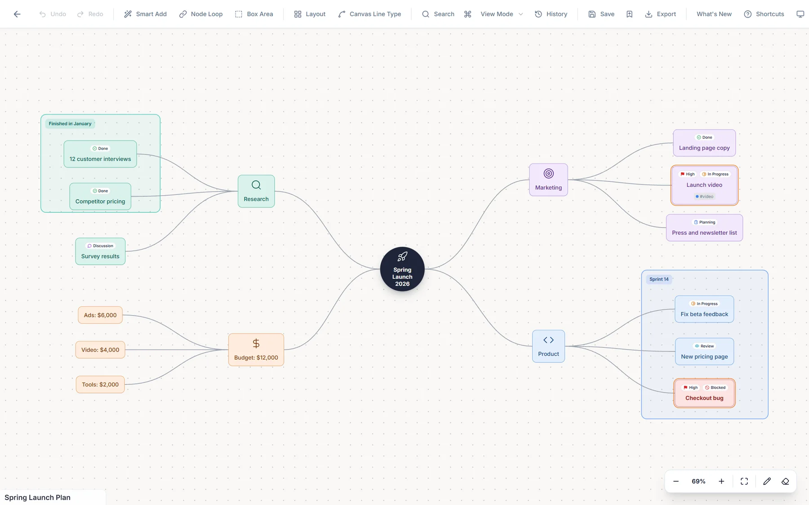
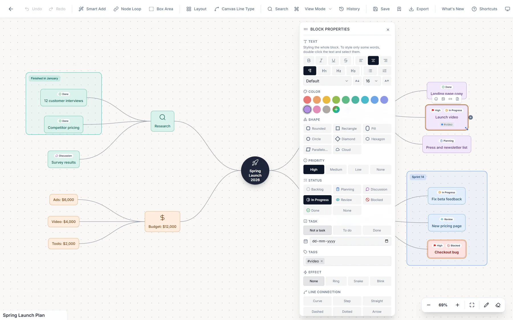
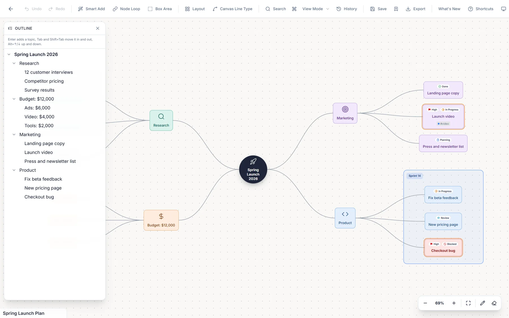
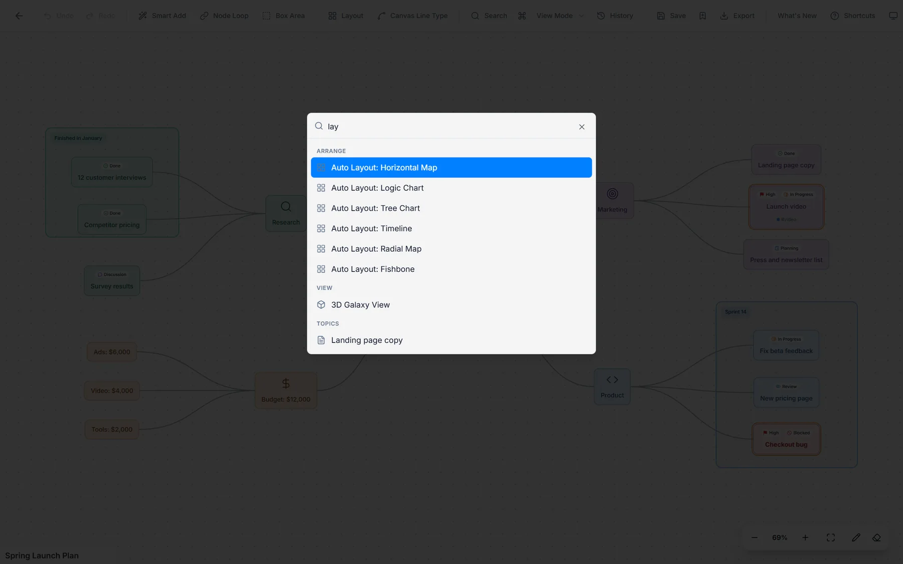
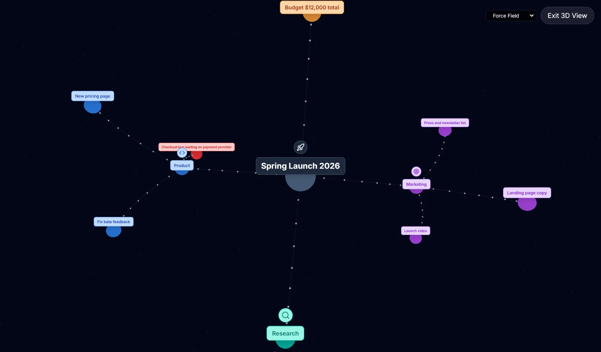
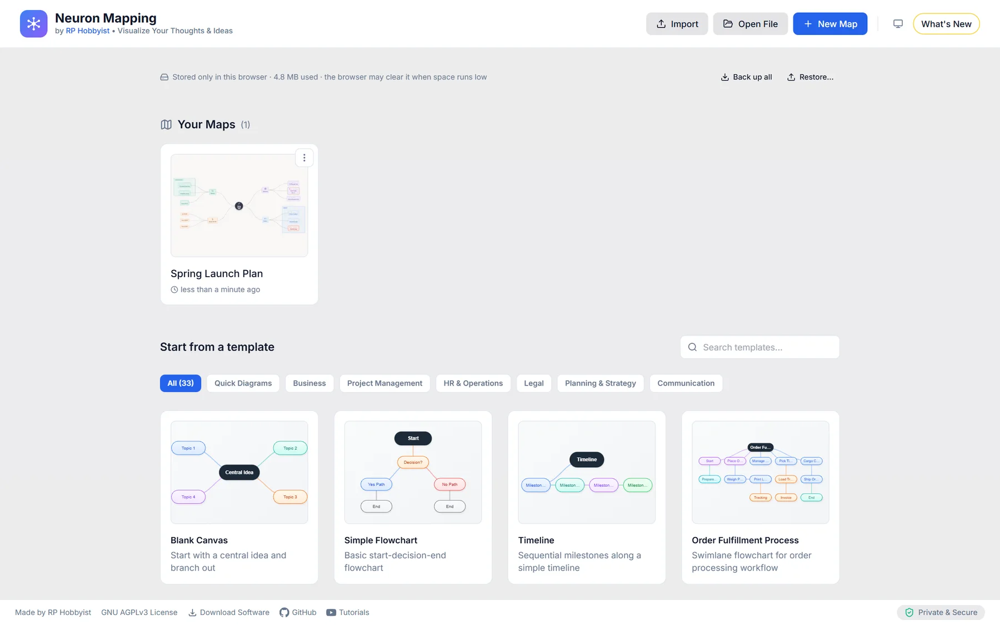

# Neuron Mapping

<div align="center">
  

  <p><strong>A free, open-source mind mapping tool that runs in your browser.</strong><br>
  No account and no cookies. Your maps stay on your device.</p>

  [](https://github.com/RPHobbyist/Neuron-Mapping/releases)
  [](https://github.com/RPHobbyist/Neuron-Mapping)
  [](LICENSE)
  [](https://neuron-mapping.rphobbyist.com/)

  [Use it online](https://neuron-mapping.rphobbyist.com/) · [Desktop download](https://github.com/RPHobbyist/Neuron-Mapping/releases) · [Video tutorial](https://youtu.be/tZC3a-83HXI)
</div>



## Contents
- [About](#about)
- [What's new in version 1.7.0](#whats-new-in-version-170)
- [A look around](#a-look-around)
- [Features](#features)
- [Desktop app](#desktop-app)
- [Run it from source](#run-it-from-source)
- [Host your own copy](#host-your-own-copy)
- [License](#license)

## About

Neuron Mapping is a mind map editor for brainstorming, studying and planning projects. You can start from a blank canvas or any of the 30+ templates, then arrange topics by hand or with an automatic layout. Topics can hold formatted text, Markdown notes, tags, pictures, links, a status, a priority and a due date.

Your maps are saved in your browser's own storage and are never sent to a server, so there is no sign-up and the editor keeps working offline once it has loaded. You can back up all your maps to one file and restore them in any browser.

New to it? The [video tutorial](https://youtu.be/tZC3a-83HXI) walks through the basics in a few minutes.

<!-- changelog:start (written from src/data/changelog.ts by `npm run changelog:readme`) -->
## What's new in version 1.7.0

Version 1.7.0 brings text formatting, tasks and new layouts, keeps your maps safer, and works offline.

- **Text formatting in topics**: Make words bold, italic, underlined or struck through, change their font and size, or turn a line into a heading, right inside a topic. Ctrl+B, Ctrl+I and Ctrl+U work as you'd expect.
- **Backups and safer storage**: Back up every map, snapshot, template and unsaved change to one file, and restore it in any browser. Maps are stored one by one, and the browser is asked to keep them.
- **Works offline**: Install Neuron Mapping as an app. Once opened, the editor loads and saves maps without a connection.
- **Tasks and due dates**: Tick topics off as tasks, see how much of each branch is done, give topics a due date, and hide what is done.
- **More layouts**: Logic chart, timeline and fishbone layouts, radial rings sized to their topics, and any layout applied to just the selected branch.
- **Copy, paste and the outline**: Copy blocks into another tab, or into other apps as an indented list (bullets in word processors), paste any list as topics or a picture onto a block, and edit the map as an indented list in the Outline.
- **Box areas**: Draw a named box around a group of topics. Drag the box and everything inside moves with it.
- **Command palette and right-click menu**: Ctrl+K finds any command, topic or saved map by typing. Right-click a topic, or the empty canvas, for what you can do there.
- **Presentation mode**: Present a map topic by topic, or a whole branch at a time like slides, with the view following along, arrow keys, pause, speed and full screen.
- **Automatic version history**: Every save keeps the version it replaces, with a thumbnail, next to the snapshots you take. A deleted map comes back with Undo.
- **Dark mode**: The editor can follow your system's dark theme, or you can pick one; exported images stay light.
- **Markdown notes**: Notes are written in Markdown and shown formatted, with task lists, tables and links.
- **Collapse and expand branches**: Fold a branch away with the chip under its topic or Ctrl+., show the map down to a level, and open everything again. Search opens the branch a hit is in.
- **One branch, Zen mode and the minimap**: Show one branch alone with a trail back to the whole map, hide everything but the map, and find your way around with a minimap.
- **Edit several blocks at once**: Select several blocks with Shift and change their color, shape, text style, priority or status together, in one undo step.
- **Rearrange in a keystroke**: Ctrl+Enter puts a new parent above a topic, Shift+Tab moves it up a level, and a topic dropped on another becomes its child. Undo goes back 100 steps.
- **Keyboard and navigation**: Enter adds a sibling, Ctrl+D duplicates, Ctrl+A selects everything, Ctrl+S saves and Alt+↑/↓ moves a branch among its siblings. P, E, B and F pick the pencil, eraser, box area and fit to screen, and toolbar tooltips show each shortcut. Scrolling pans, Ctrl+scroll or a pinch zooms at the pointer, and a map opens fitted to the window, or where you left it.
- **Tags, pictures and links**: Tag blocks with chips, one or several at a time, and search by tag or by notes; Smart Add matches them too. Pictures can be pasted, dropped on a block or given by address, and pictures, links and icons can be changed or removed.
- **Copy style, status colors and numbering**: Copy one block's look onto others with Ctrl+Alt+C and Ctrl+Alt+V. Done, overdue and urgent topics stand out, tags have colors and highlight their topics, and topics can be numbered 1, 1.1, 1.1.1.
- **Type shorthand**: Typing [ ] makes a task, #word adds a tag and !! sets high priority, in a topic or in pasted text.
- **More ways to export**: Copy the map as an image, export SVG, print PDFs on A4 or Letter, and export Markdown, OPML, text or CSV outlines that import back.
- **Faster large maps**: Maps of 10,000 topics stay usable: they open, zoom, pan, paste and lay out with far less waiting.
- **Unsaved changes, map by map**: Each map keeps its own unsaved changes, so two maps never overwrite each other, and you are warned when a map is open in two tabs. Unsaved work can be picked up again, or thrown away, from the start page.
- **A library for your maps**: Search and sort your saved maps, pin the ones you use most to the top, and rename, duplicate, export or delete one from the menu on its card.
- **Your own colors**: Pick any color with the color picker, and it stays in your saved colors for next time.
- **Rounder lines and line tension**: Step lines turn with rounded corners and find their way around topics. Set how far a curve bows out, or where a step line bends, from the line properties.
- **Pencil colors and line gradients**: Choose the pencil's color and width, and let a line blend from its parent block's color into its own.
<!-- changelog:end -->

## A look around

**Properties panel.** Select a topic to change its text style, color, shape, priority, status, task state, due date, tags and line style.



**Outline view.** The same map as an indented list. Enter adds a topic, Tab and Shift+Tab move it in and out, and every change shows up on the canvas.



**Command palette.** Press Ctrl+K to find any command, topic or saved map by typing.



**3D view.** Walk around a map in three dimensions, as a projection of the flat map or as a force-directed graph.



**Your maps and templates.** Saved maps sit at the top of the start page with a thumbnail each, and the templates are grouped by category below them.



## Features

**Editing**
- Rich text inside topics, with headings, lists, fonts and sizes.
- Eight shapes, a palette of colors plus your own, icons and pictures.
- Curved, straight, step, dashed, dotted and arrow lines, with labels, gradients and adjustable tension.
- Relation lines between any two topics, box areas to group topics, and a pencil for freehand notes.
- Keyboard-first editing: Enter adds a sibling, Tab adds a child, Ctrl+D duplicates, Alt+↑/↓ reorders, and Undo goes back 100 steps.
- Copy and paste between tabs and other apps. Pasted lists become topics.
- Type shorthand: `[ ]` makes a task, `#word` adds a tag and `!!` sets high priority.

**Layouts and views**
- Horizontal map, logic chart, tree chart, timeline, radial map and fishbone layouts, applied to the whole map or one branch.
- Collapse and expand branches, show one branch on its own, zen mode and a minimap.
- Presentation mode that moves through the map topic by topic or branch by branch.
- A 3D view and an outline view.
- Dark mode for the editor. Exported images stay light.

**Organizing**
- Status, priority, tags with colors, tasks with progress per branch, due dates and numbering (1, 1.1, 1.1.1).
- Search by text, tag or notes, and filter by color, status and priority.
- Markdown notes on every topic, with task lists, tables and links.
- A library of saved maps you can search, sort, pin, rename, duplicate and export.

**Import and export**
- Import Markdown, CSV, OPML, JSON, XML, plain text, XMind (`.xmind`) and FreeMind/Freeplane (`.mm`), as a new map or as a branch of any topic.
- Export PNG, SVG and PDF (A4 or Letter, across several pages for large maps), or copy the map as an image.
- Export Markdown, OPML, text and CSV outlines that import back into the same map.
- Save maps as `.nmm` files.

**Saving and privacy**
- Maps are kept in your browser (IndexedDB). There is no account, no cookies, and maps are never uploaded.
- Unsaved changes are kept per map, so a reload, a crash or a second tab doesn't lose them.
- Every save keeps the version it replaces, next to the snapshots you take yourself.
- Back up every map, snapshot and template to one `.nmmbackup` file and restore it anywhere.
- Install it as an app and it works offline.
- Large maps stay usable. The test suite opens and edits maps of 10,000 topics.

## Desktop app

A Windows build is on the [Releases page](https://github.com/RPHobbyist/Neuron-Mapping/releases). Download `Neuron_Mapping_v.1.5.0.zip`, unzip it and run `Neuron Mapping.exe`.

The desktop build is version 1.5.0, so it doesn't have the 1.6 and 1.7 features yet. The [web app](https://neuron-mapping.rphobbyist.com/) is always the latest version, and you can install it from the browser to use it like a desktop app, offline included.

## Run it from source

You need [Node.js](https://nodejs.org/) 22.12 or newer (the exact version is in `.node-version`).

```bash
git clone https://github.com/RPHobbyist/Neuron-Mapping.git
cd Neuron-Mapping
npm ci
npm run dev
```

Then open http://localhost:8080.

| Command | What it does |
|---|---|
| `npm run dev` | Starts the development server |
| `npm run build` | Builds the site into `dist/`, prerenders the public pages and writes the service worker |
| `npm run preview` | Serves the built site locally |
| `npm run lint` | Runs ESLint |
| `npm run typecheck` | Type-checks the app, scripts and tests |
| `npm test` | Runs the unit tests (Vitest) |
| `npm run test:e2e` | Runs the browser tests (Playwright) against the build. Run `npx playwright install chromium` once first |
| `npm run changelog:readme` | Rewrites the What's New section of this README from `src/data/changelog.ts` |

The app is built with React, TypeScript, Vite, Tailwind CSS and Three.js (for the 3D view).

## Host your own copy

`npm run build` produces a static site in `dist/` that any static host can serve. The public pages are prerendered, and the editor lives at `/workspace` (`workspace.html`).

The repository is set up for Cloudflare Pages: `public/_headers` sets the security headers and caching, `public/_routes.json` decides which paths run the function, and `functions/_middleware.js` blocks sensitive paths and returns real 404s. On another host, set up the same headers there, including the Content-Security-Policy.

To use your own name, links and logo in a fork, copy `.env.example` to `.env` and fill in what you want to change. Every variable is optional and falls back to the defaults in `src/lib/core/core-system.ts`.

## License

Neuron Mapping is free software: you can redistribute it and/or modify it under the terms of the GNU Affero General Public License as published by the Free Software Foundation, either version 3 of the License, or (at your option) any later version. See [`LICENSE`](LICENSE) for the full text.

If you run a modified copy as a public web service, the AGPL asks you to offer your users the source code of your version.

<div align="center">
  Made by <a href="https://www.rphobbyist.com">RP Hobbyist</a>
</div>
